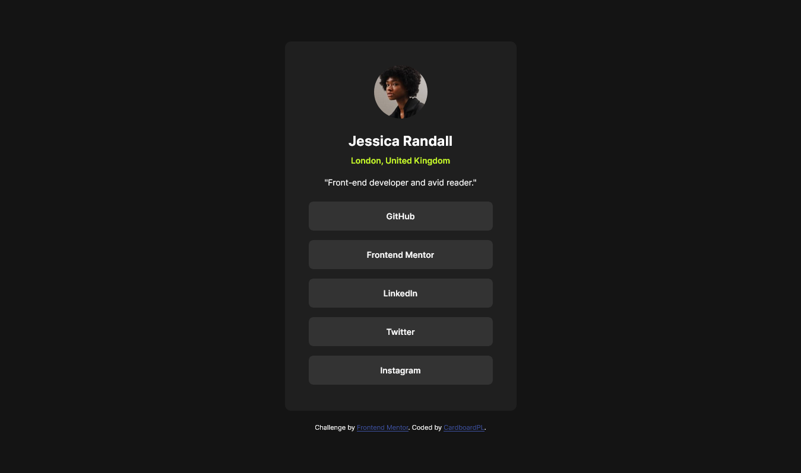
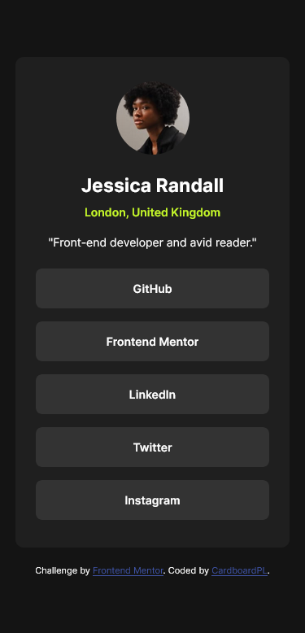

# Frontend Mentor - Social links profile solution

This is a solution to the [Social links profile challenge on Frontend Mentor](https://www.frontendmentor.io/challenges/social-links-profile-UG32l9m6dQ). Frontend Mentor challenges help you improve your coding skills by building realistic projects. 

## Table of contents

- [Overview](#overview)
  - [The challenge](#the-challenge)
  - [Screenshot](#screenshot)
  - [Links](#links)
- [My process](#my-process)
  - [Built with](#built-with)
  - [What I learned](#what-i-learned)
  - [Continued development](#continued-development)
  - [Useful resources](#useful-resources)
- [Author](#author)

## Overview

### The challenge

Users should be able to:

- See hover and focus states for all interactive elements on the page

### Screenshot

### Links

- Solution URL: [GitHub Repo](https://github.com/CardboardPL/Frontend-Mentor-Social-links-profile)
- Live Site URL: [GitHub Pages](https://cardboardpl.github.io/Frontend-Mentor-Social-links-profile/)

## My process

### Built with

- Semantic HTML5 markup
- CSS
- Flexbox
- Desktop-first workflow

### What I learned

I learned about the usage of the address tag and how to utilize the :focus-within pseudo class so that if a child of an element is being selected it will update the parent element.

### Continued development

I plan to use this as an inspiration for my future projects

### Useful resources

- [MDN's article about the :focus-within Pseudo Class](https://developer.mozilla.org/en-US/docs/Web/CSS/:focus-within) - This helped me by letting me know how to utilize the pseudo class and figure out how to select the parent element when one of its children is being selected.

## Author

- Frontend Mentor - [@CardboardPL](https://www.frontendmentor.io/profile/CardboardPL)
- Twitter - [@SirPLWasTaken](https://www.twitter.com/SirPLWasTaken)
